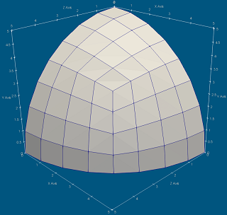

# FinEtools Use Case

Here we show how to use the package FinEtools in user's own projects. The package itself comes with many examples,  but they only use the facilities of the package and here the situation is  different in that the user's  code is mixed in  with the FinEtools  code base.

At issue  are the workflows that enable tight (or loose) control of the name conflicts that can occur when user's code is used together with somebody else's. 

We offer  two methods. The use case is the following: the user wrote a function  to generate the surface  mesh of 1/8  of a spherical surface. (This function is not  part of FinEtools.)

The user takes advantage of the various facilities of the mesh-generation, mesh-modification, and mesh-export functionality of the FinEtools package. The code  and brief discussions  in markdown are  in the two corresponding subfolders:

- [Method 1](Method_1/method1.md): The user does not change the definition  of the  public interface  to the functionality of the FinEtools package.

- [Method 2](Method_2/method2.md): The user changes the definition  of the  public interface  to the functionality of the FinEtools package in an arbitrary way, potentially changing every aspect of the exported interface.

